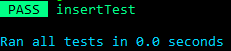
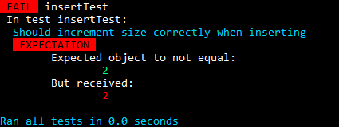

# Easytest
## Introduction

 
A small test module inspired by the javascript test
library jest and the python test library unittest.

Easytest provides a lightweight testing API with helpful error 
messages and debugging tools.

It's easiest to show how it works by example:

```Python
from Easytest import TestSuite

class TreapTest(TestSuite):
    def beforeEach(self):
        self.treap = Treap()

    def afterEach(self):
        self.treap.healthy()

    # Tests are methods in the TestSuite that end with "Test".
    def insertTest(self):
        self.it("Should increment size correctly when inserting")
        self.treap.insert("B")
        self.expect(self.treap.size()).toEqual(1)
        self.treap.insert("B")
        # does not increment size when not inserting new
        self.expect(self.treap.size()).Not.toEqual(2) 
        self.treap.insert("C")
        self.expect(self.treap.size()).toEqual(2)

    # add more tests if wanted

if __name__ == "__main__":
    TreapTest().run() # run all tests in TreapTest
```

Which produces the following output if it passes:



And if it fails:



It's that easy.

It is recommended that you run it inside a [TestSuite](#TestSuite) but 
you can also directly construct an Expect object. `self.expect` 
is just an instance of [Expect](#Expect) with a fancy message handler tied to it.

```Python
from Easytest import Expect
# The below passes if object is a *subset* of expected. Useful
# for testing if data is unknown or unimportant. So these pass:
Expect([1,2,3,4]).toHaveLength(4)
Expect(["A","B",{}]).toBeSubset([str,"B",dict])
Expect({"a":["B","C"]}).toBeSubset({"a":[str]})
```

Test for errors easily:

```Python
Expect(lambda: 2+"2").toThrow(TypeError)
Expect(math.sqrt).toThrowWith(-1)
Expect(lambda x,y,z: (x+y)/(z-1)).toThrowWith(1,1,1) # passes 1,1,1 to function
```

There are an abundancy of available methods listed in the [API reference](#API).

## API reference
* [Introduction](#introduction)
* [API Reference](#api-reference)
    * [TestSuite](#testsuite)
        * [.beforeEach](#.beforeEach)
        * [.afterEach](#.afterEach)
        * [.run](#.run)
        * [.expect](#.expect)
        * [.it](#.it)
    * [Expect](#Expect)
        * [.toBe](#.toBe)
        * [.toBeCloseTo](#.toBeCloseTo)
        * [.toBeFalsy](#.toBeFalsy)
        * [.toBeGreaterThan](#.toBeGreaterThan)
        * [.toBeGreaterThanOrEqual](#.toBeGreaterThanOrEqual)
        * [.toBeInstanceOf](#.toBeInstanceOf)
        * [.toBeLessThan](#.toBeLessThan)
        * [.toBeLessThanOrEqual](#.toBeLessThanOrEqual)
        * [.toBeNone](#.toBeNone)
        * [.toBeSubset](#.toBeSubset)
        * [.toBeTruthy](#.toBeTruthy)
        * [.toBeWithinRange](#.toBeWithinRange)
        * [.toEqual](#.toEqual)
        * [.toHaveLength](#.toHaveLength)
        * [.toMatch](#.toMatch)
        * [.toThrow](#.toThrow)
        * [.toThrowWith](#.toThrowWith)

### [TestSuite](#testsuite)
Class for running test suites with setup, teardown, and better debug messages.

Inherit from this class and create tests in the form of methods: **All test methods should end with "Test"**.

* #### [.beforeEach](#beforeEach)

`.beforeEach()`

This function is called before each testcase. Feel free to override.

* #### [.afterEach](#.afterEach)

`.afterEach()`.

This function is called after each testcase. Feel free to override.

* #### [.run](#.run)

`.run()`

Runs all tests, that is, all class methods whose names ends with "Test".
If any test fails, continue to run other tests. Displays helpful information
while running the tests and reports whether a test failed or succeeded.
If a test fails, a helpful error message is displayed after running all tests.

* #### [.expect](#.expect)

`.expect(obj)`

Returns an [Expect](#Expect) object connected to this test suite.

Parameter obj: The object that can be examined with further methods of [Expect](#Expect), like 
```Python
self.expect(str([1,2,3])).toEqual("[1, 2, 3]")
```

* #### [.it](#.it)

Sets a description for the test. 

Can set multiple descriptions in one test, the last one used will be active. This can be used to set different descriptions for different expectations within a test:

```Python
self.it("handles empty case")
self.expect(sum([])).toEqual(0)
self.it("throws TypeError if type not compatible")
self.expect(sum([3,"3"])).toThrow(TypeError)
```

### [Expect](#Expect)

When you're writing tests, you often need to check that values meet
certain conditions. Expect gives access to a number of methods
that let you validate different things.

Each public method represents different expectations of the 
object's content. If an expectation fails, a neat error message is 
assured.


* #### [.Not](#.Not)

`.Not`

Returns an identical Expect object but with 
methods that test for the opposite of normal. Usage:

```Python
Expect(math.pi).Not.toBeLessThan(3.14)
```

* #### [.toBe](#.toBe)

`Expect(obj).toBe(expected)`

Expects any object.

Passes if the object is (strictly the same) the expected object, that is, if `obj is expected`


* #### [.toBeCloseTo](#.toBeCloseTo)

`Expect(number).toBeCloseTo(target, numDigits=2)`

Expects a number.

Passes if `number` is sufficiently close to `target` when accounting for floating point errors. 

Parameter `numDigits` is the number of digits in which the numbers correspond. It has a default value 2 which means that the test passes if `abs(target - number) < 0.005` (that is, `10 ** -2 / 2`).

* #### [.toBeFalsy](#.toBeFalsy)

`Expect(obj).toBeFalsy()`

Expects any object.

Passes if `obj` is falsy (that is, `not obj` is `True`)

* #### [.toBeGreaterThan](#.toBeGreaterThan)

`Expect(number).toBeGreaterThan(expected)`

Expects a number.

Passes if received number is greater than expected number.

* #### [.toBeGreaterThanOrEqual](#.toBeGreaterThanOrEqual)

`Expect(number).toBeGreaterThanOrEqual(expected)`

Expects a number.

Passes if received `number` is greater than or equal to `expected`.

* #### [.toBeInstanceOf](#.toBeInstanceOf)

`Expect(obj).toBeInstanceOf(expectedClass)`

Expects any object.

Passes if `obj` is instance of `expectedClass`.

* #### [.toBeLessThan](#.toBeLessThan)

`Expect(number).toBeLessThan(expected)`


Expects a number.

Passes if `number` is less than `expected`.

* #### [.toBeLessThanOrEqual](#.toBeLessThanOrEqual)

`Expect(number).toBeLessThan(expected)`

Expects a number.

Passes if `number` is less than or equal to `expected`.

* #### [.toBeNone](#.toBeNone)

`Expect(obj).toBeNone()`

Expects any object.

Passes if `obj is None`.

* #### [.toBeSubset](#.toBeSubset)

`Expect(obj).toBeSubset(expected)`

Expects an object.

Passes if `obj` is a subset of the `expected` object.

Note that lists are sensitive to order, so `[1,2,3]` is not a subset of `[2,3,1]`.

You can pass classes if you don't want to be specific 
about the value that is allowed.

Example: `Expect({"a":4}).toBeSubset({"a":int})` would pass.

When faced with a list such as `[<class>]`, a list is a subset if all items are an instance of the class. For example, this passes: `Expect([1,2,3,4,5]).toBeSubset([int])`.

* #### [.toBeTruthy](#.toBeTruthy)

`Expect(obj).toBeTruthy()`

Expects any object.

Passes if `obj` is truthy (that is, `not not obj` is `True`)

* #### [.toBeWithinRange](#.toBeWithinRange)

`Expect(number).toBeWithinRange(low, high)`

Expects any number.

Passes if `low <= number < high`.

* #### [.toEqual](#.toEqual)

`Expect(obj).toEqual(expected)`

Expects any object.

Passes if `obj == expected`.

* #### [.toHaveLength](#.toHaveLength)

`Expect(obj_with_length).toHaveLength(expected)`

Expects any object with a length (that is, an object with implements `__len__`).

Passes if `len(obj_with_length) == expected`.

* #### [.toMatch](#.toMatch)

`Expect(string).toMatch(regex, flags=0)`

Expects a string.

Passes if the string matches (re.search) the regular expression. You can pass flags
as usual.

* #### [.toThrow](#.toThrow)

`Expect(function).toThrow(exception)`

Expects a function.

Passes if `function` throws an exception that is an instance of `exception`.

* #### [.toThrowWith](#.toThrowWith)

`Expect(function).toThrow(*args, **kwargs)`

Expects a function.

Passes if `function` throws an exception with the provided arguments.
